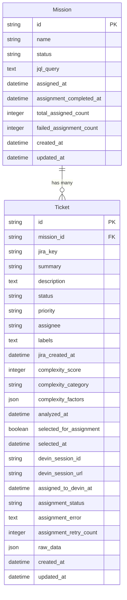

# Entity Model - Devinator

## Overview

This document describes the entity model for Devinator, a Ruby on Rails application designed to help development teams tackle tech debt more efficiently by identifying low-complexity bug tickets in their JIRA backlog and assigning them to an AI engineer (Devin) for automated resolution.

## Entities

### Mission
Represents a workflow session for analyzing and assigning tickets.

**Attributes:**
- `id` (String, Primary Key) - Generated unique identifier
- `name` (String, Not Null) - Auto-generated name in format "Mission - YYYY-MM-DD HH:MM:SS"
- `status` (String, Not Null) - Current mission status: "draft", "in_progress", "assigned", "completed"
- `jql_query` (Text, Nullable) - JQL query used to fetch tickets from JIRA
- `assigned_at` (DateTime, Nullable) - When tickets were assigned to Devin (UC006)
- `assignment_completed_at` (DateTime, Nullable) - When all assignment operations completed (UC006)
- `total_assigned_count` (Integer, Not Null, Default: 0) - Count of successfully assigned tickets (UC006)
- `failed_assignment_count` (Integer, Not Null, Default: 0) - Count of failed assignments (UC006)
- `created_at` (DateTime, Not Null) - Mission creation timestamp
- `updated_at` (DateTime, Not Null) - Last modification timestamp

### Ticket
Represents a JIRA ticket fetched for a mission.

**Attributes:**
- `id` (String, Primary Key) - Generated unique identifier
- `mission_id` (String, Foreign Key, Not Null) - Reference to Mission
- `jira_key` (String, Not Null) - JIRA ticket key (e.g., "PROJ-123")
- `summary` (String, Not Null) - Ticket title/summary
- `description` (Text, Nullable) - Full ticket description
- `status` (String, Not Null) - JIRA ticket status
- `priority` (String, Nullable) - JIRA ticket priority
- `assignee` (String, Nullable) - JIRA assignee name/email
- `labels` (Text, Nullable) - Comma-separated labels
- `jira_created_at` (DateTime, Nullable) - When ticket was created in JIRA
- `complexity_score` (Integer, Nullable) - Complexity score 1-10 (UC004)
- `complexity_category` (String, Nullable) - Complexity category: "low", "medium", "high" (UC004)
- `complexity_factors` (JSON, Nullable) - Detailed breakdown of complexity scoring factors (UC004)
- `analyzed_at` (DateTime, Nullable) - When complexity analysis was performed (UC004)
- `selected_for_assignment` (Boolean, Not Null, Default: false) - Whether ticket is selected for AI assignment (UC005)
- `selected_at` (DateTime, Nullable) - When ticket was selected for assignment (UC005)
- `devin_session_id` (String, Nullable) - Devin session identifier (UC006)
- `devin_session_url` (String, Nullable) - URL to Devin session (UC006)
- `assigned_to_devin_at` (DateTime, Nullable) - When ticket was assigned to Devin (UC006)
- `assignment_status` (String, Not Null, Default: "pending") - Assignment status: "pending", "assigned", "failed", "timeout" (UC006)
- `assignment_error` (Text, Nullable) - Error message if assignment failed (UC006)
- `assignment_retry_count` (Integer, Not Null, Default: 0) - Number of retry attempts for assignment (UC006)
- `raw_data` (JSON, Nullable) - Full JIRA API response for debugging
- `created_at` (DateTime, Not Null) - Record creation timestamp
- `updated_at` (DateTime, Not Null) - Last modification timestamp

## Entity Relationship Diagram

## Status Values

### Mission Status
- `draft` - Mission created but not yet started
- `in_progress` - Mission is being worked on
- `assigned` - Tickets have been assigned to Devin (UC006)
- `completed` - Mission workflow finished

### Ticket Complexity Category (UC004)
- `low` - Complexity score 1-3, suitable for AI assignment
- `medium` - Complexity score 4-7, moderate difficulty
- `high` - Complexity score 8-10, high difficulty

### Ticket Assignment Status (UC006)
- `pending` - Ticket not yet assigned to Devin (default)
- `assigned` - Ticket successfully assigned to Devin
- `failed` - Assignment to Devin failed
- `timeout` - Assignment to Devin timed out

## Business Rules

### Mission Rules
- Mission names are auto-generated with timestamp: "Mission - YYYY-MM-DD HH:MM:SS"
- Each mission starts in "draft" status
- Mission creation timestamp is automatically recorded
- JQL query cannot be empty when saving
- Only one JQL query per mission is allowed
- Mission status changes to "in_progress" when JQL query is saved
- JQL query can be modified until tickets are fetched

### Ticket Rules
- Tickets are associated with exactly one mission
- `jira_key` must be unique within a mission
- Tickets must include minimum fields: `jira_key`, `summary`, `status`
- Description preview is limited to first 200 characters in UI
- Tickets are stored with the mission for future analysis
- Ticket data is cached to avoid repeated JIRA API calls
- `raw_data` stores the complete JIRA API response for debugging and audit purposes

### Complexity Analysis Rules (UC004)
- Complexity score range is 1-10 (clamped after calculation)
- Complexity categories: low (1-3), medium (4-7), high (8-10)
- Only tickets with type "Bug" are considered for AI assignment
- Complexity analysis is deterministic (same ticket = same score)
- Analysis results are cached to avoid re-computation
- `complexity_factors` JSON stores detailed breakdown of scoring factors
- `analyzed_at` timestamp tracks when analysis was performed
- Complexity scores cannot be manually overridden by users
- Tickets require minimum description to be analyzable

### Ticket Selection Rules (UC005)
- Tickets default to `selected_for_assignment=false` when created
- On first visit to selection step (no existing selections in mission), all low-complexity bugs are automatically preselected
- If mission has any tickets with `selected_for_assignment=true`, existing selection is preserved (no auto-preselection)
- Users can manually select/deselect any tickets regardless of complexity
- At least one ticket must be selected to proceed to assignment
- Maximum of 100 tickets can be selected for assignment in one batch (hard limit)
- Warning displayed when more than 50 tickets selected
- Selection is persisted atomically when user proceeds to next step
- `selected_at` timestamp records when ticket was last selected
- Deselecting a ticket sets `selected_for_assignment=false` and `selected_at=null`

### Ticket Assignment Rules (UC006)
- Only tickets with `selected_for_assignment=true` are assigned to Devin
- Each ticket gets a unique Devin session
- Assignment is performed sequentially with progress tracking
- Failed assignments do not block successful ones
- Devin session URL must be stored for user access
- Mission status changes to "assigned" only after at least one successful assignment
- Original JIRA ticket ID and key are included in Devin session request
- Ticket title, description, and relevant metadata are sent to Devin
- Maximum 100 tickets can be assigned in one operation
- Assignment timeout is 30 seconds per ticket
- Failed assignments can be retried individually
- `assignment_retry_count` tracks the number of retry attempts
- Assignment is idempotent (safe to retry)
- `assignment_status` is updated for each assignment attempt
- `assigned_to_devin_at` timestamp records successful assignment
- Mission `total_assigned_count` and `failed_assignment_count` are updated after each assignment batch
