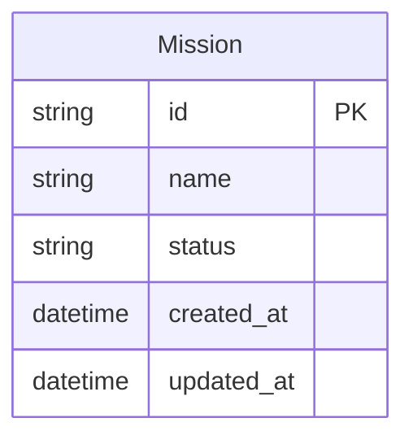

# Entity Model - Devinator

## Overview

This document describes the entity model for Devinator, a Ruby on Rails application designed to help development teams tackle tech debt more efficiently by identifying low-complexity bug tickets in their JIRA backlog and assigning them to an AI engineer (Devin) for automated resolution.

## Entities

### Mission
Represents a workflow session for analyzing and assigning tickets.

**Attributes:**
- `id` (String, Primary Key) - Generated unique identifier
- `name` (String, Not Null) - Auto-generated name in format "Mission - YYYY-MM-DD HH:MM:SS"
- `status` (String, Not Null) - Current mission status: "draft", "in_progress", "completed"
- `created_at` (DateTime, Not Null) - Mission creation timestamp
- `updated_at` (DateTime, Not Null) - Last modification timestamp

## Entity Relationship Diagram

## Status Values

### Mission Status
- `draft` - Mission created but not yet started
- `in_progress` - Mission is being worked on
- `completed` - Mission workflow finished

## Business Rules

### Mission Rules
- Mission names are auto-generated with timestamp: "Mission - YYYY-MM-DD HH:MM:SS"
- Each mission starts in "draft" status
- Mission creation timestamp is automatically recorded
