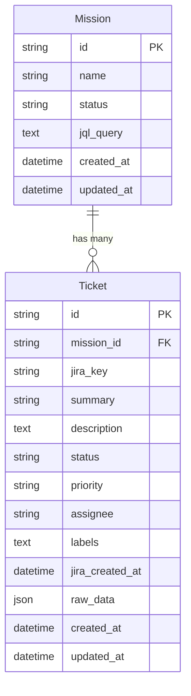

# Entity Model - Devinator

## Overview

This document describes the entity model for Devinator, a Ruby on Rails application designed to help development teams tackle tech debt more efficiently by identifying low-complexity bug tickets in their JIRA backlog and assigning them to an AI engineer (Devin) for automated resolution.

## Entities

### Mission
Represents a workflow session for analyzing and assigning tickets.

**Attributes:**
- `id` (String, Primary Key) - Generated unique identifier
- `name` (String, Not Null) - Auto-generated name in format "Mission - YYYY-MM-DD HH:MM:SS"
- `status` (String, Not Null) - Current mission status: "draft", "in_progress", "completed"
- `jql_query` (Text, Nullable) - JQL query used to fetch tickets from JIRA
- `created_at` (DateTime, Not Null) - Mission creation timestamp
- `updated_at` (DateTime, Not Null) - Last modification timestamp

### Ticket
Represents a JIRA ticket fetched for a mission.

**Attributes:**
- `id` (String, Primary Key) - Generated unique identifier
- `mission_id` (String, Foreign Key, Not Null) - Reference to Mission
- `jira_key` (String, Not Null) - JIRA ticket key (e.g., "PROJ-123")
- `summary` (String, Not Null) - Ticket title/summary
- `description` (Text, Nullable) - Full ticket description
- `status` (String, Not Null) - JIRA ticket status
- `priority` (String, Nullable) - JIRA ticket priority
- `assignee` (String, Nullable) - JIRA assignee name/email
- `labels` (Text, Nullable) - Comma-separated labels
- `jira_created_at` (DateTime, Nullable) - When ticket was created in JIRA
- `raw_data` (JSON, Nullable) - Full JIRA API response for debugging
- `created_at` (DateTime, Not Null) - Record creation timestamp
- `updated_at` (DateTime, Not Null) - Last modification timestamp

## Entity Relationship Diagram

## Status Values

### Mission Status
- `draft` - Mission created but not yet started
- `in_progress` - Mission is being worked on
- `completed` - Mission workflow finished

## Business Rules

### Mission Rules
- Mission names are auto-generated with timestamp: "Mission - YYYY-MM-DD HH:MM:SS"
- Each mission starts in "draft" status
- Mission creation timestamp is automatically recorded
- JQL query cannot be empty when saving
- Only one JQL query per mission is allowed
- Mission status changes to "in_progress" when JQL query is saved
- JQL query can be modified until tickets are fetched

### Ticket Rules
- Tickets are associated with exactly one mission
- `jira_key` must be unique within a mission
- Tickets must include minimum fields: `jira_key`, `summary`, `status`
- Description preview is limited to first 200 characters in UI
- Tickets are stored with the mission for future analysis
- Ticket data is cached to avoid repeated JIRA API calls
- `raw_data` stores the complete JIRA API response for debugging and audit purposes
