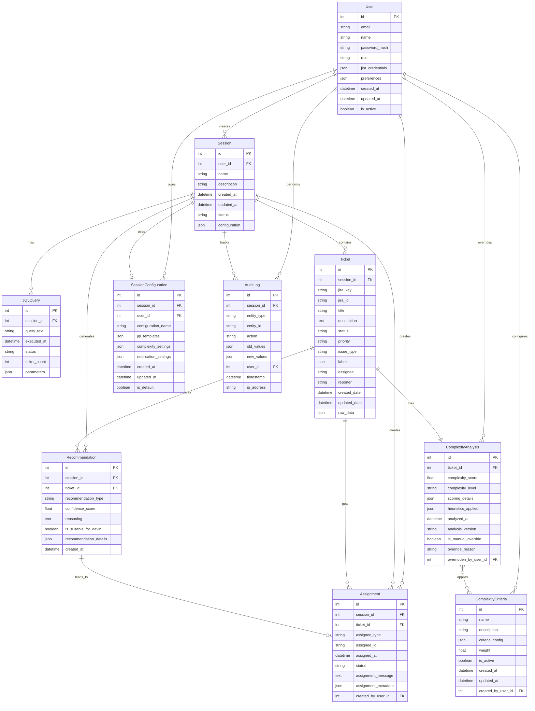

# Entity Model

This document defines the core entities and their relationships for the Devinator system based on the functional requirements and user flow.

## Entity Relationship Diagram

## Entity Descriptions

### User
**Purpose**: Represents system users who can create sessions and manage ticket assignments.

**Key Attributes**:
- `id`: Unique identifier (Primary Key)
- `email`: User's email address (unique)
- `name`: User's display name
- `role`: User role (admin, team_lead, developer)
- `jira_credentials`: Encrypted JIRA API tokens/credentials
- `preferences`: User preferences for UI and notifications

**Business Rules**:
- Email must be unique across the system
- JIRA credentials are required for API access
- Role determines permissions for AI assignment
- Only team_lead and admin roles can assign tickets to Devin

### Session
**Purpose**: Represents a user's working session for analyzing and assigning tickets.

**Key Attributes**:
- `id`: Unique identifier (Primary Key)
- `user_id`: Foreign key to User who created the session
- `name`: User-defined session name
- `status`: Current session state (active, completed, archived)
- `configuration`: JSON object storing session-specific settings

**Business Rules**:
- A session must have at least one JQL query to be considered active
- Sessions can be saved and resumed later
- Only one session per user can be active at a time

### JQLQuery
**Purpose**: Stores JQL queries used to fetch tickets from JIRA.

**Key Attributes**:
- `query_text`: The actual JQL query string
- `executed_at`: When the query was last executed
- `ticket_count`: Number of tickets returned by the query
- `status`: Query execution status (pending, success, failed)

**Business Rules**:
- Each session can have multiple JQL queries
- Queries are validated before execution
- Query history is maintained for audit purposes

### Ticket
**Purpose**: Represents a JIRA ticket fetched for analysis.

**Key Attributes**:
- `jira_key`: JIRA ticket key (e.g., "DEV-123")
- `jira_id`: Internal JIRA ticket ID
- `title`: Ticket title/summary
- `description`: Detailed ticket description
- `raw_data`: Complete JIRA API response for the ticket

**Business Rules**:
- Tickets are immutable once fetched (changes tracked via sync)
- Each ticket belongs to exactly one session
- Ticket data includes all relevant JIRA fields

### ComplexityAnalysis
**Purpose**: Stores complexity scoring and analysis results for tickets.

**Key Attributes**:
- `complexity_score`: Numerical complexity score (0.0 - 1.0)
- `complexity_level`: Categorical level (low, medium, high)
- `scoring_details`: JSON breakdown of how score was calculated
- `heuristics_applied`: Which complexity heuristics were used
- `is_manual_override`: Whether score was manually overridden
- `overridden_by_user_id`: User who made the manual override

**Business Rules**:
- Each ticket has exactly one complexity analysis
- Manual overrides are tracked with user attribution
- Analysis can be recalculated with updated criteria

### Recommendation
**Purpose**: System-generated recommendations for ticket assignment.

**Key Attributes**:
- `recommendation_type`: Type of recommendation (assign_to_devin, manual_review, etc.)
- `confidence_score`: System confidence in the recommendation
- `is_suitable_for_devin`: Boolean flag for Devin suitability
- `reasoning`: Human-readable explanation of the recommendation

**Business Rules**:
- Recommendations are generated based on complexity analysis
- Multiple recommendation types can exist per ticket
- Recommendations influence but don't dictate final assignments

### Assignment
**Purpose**: Records actual ticket assignments made by users.

**Key Attributes**:
- `assignee_type`: Type of assignee (human, ai_devin, etc.)
- `assignee_id`: Identifier of the assignee
- `assignment_message`: Message sent with the assignment
- `status`: Assignment status (pending, completed, failed)
- `created_by_user_id`: User who created the assignment

**Business Rules**:
- Assignments are created only after user confirmation
- Assignment attempts are logged for audit purposes
- Failed assignments can be retried

### ComplexityCriteria
**Purpose**: Configurable criteria used for complexity analysis.

**Key Attributes**:
- `name`: Criteria name (e.g., "title_length", "has_description")
- `criteria_config`: JSON configuration for the criteria
- `weight`: Relative weight in overall scoring
- `is_active`: Whether criteria is currently enabled
- `created_by_user_id`: User who created the criteria

**Business Rules**:
- Criteria can be enabled/disabled without deletion
- Weight changes affect future complexity calculations
- Historical analyses reference the criteria version used

### SessionConfiguration
**Purpose**: Saved configurations for reusable session setups.

**Key Attributes**:
- `user_id`: User who owns the configuration
- `configuration_name`: User-defined name for the configuration
- `jql_templates`: Predefined JQL query templates
- `complexity_settings`: Complexity analysis preferences
- `is_default`: Whether this is the user's default configuration

**Business Rules**:
- Users can have multiple saved configurations
- Only one configuration per user can be marked as default
- Configurations can be shared between sessions

### AuditLog
**Purpose**: Comprehensive audit trail of all system activities.

**Key Attributes**:
- `entity_type`: Type of entity being audited
- `action`: Action performed (create, update, delete, etc.)
- `old_values`/`new_values`: Before and after state
- `user_id`: User who performed the action

**Business Rules**:
- All significant user actions are logged
- Audit logs are immutable once created
- Logs include both user actions and system-generated events

## Data Flow Summary

1. **User Authentication**: User logs in with credentials
2. **Session Creation**: User creates a session with optional configuration
3. **Query Execution**: JQL queries fetch tickets from JIRA using user's credentials
4. **Analysis Pipeline**: Tickets are analyzed for complexity using configurable criteria
5. **Recommendation Generation**: System generates assignment recommendations
6. **User Review**: User reviews and potentially overrides recommendations
7. **Assignment Execution**: Selected tickets are assigned with full audit trail