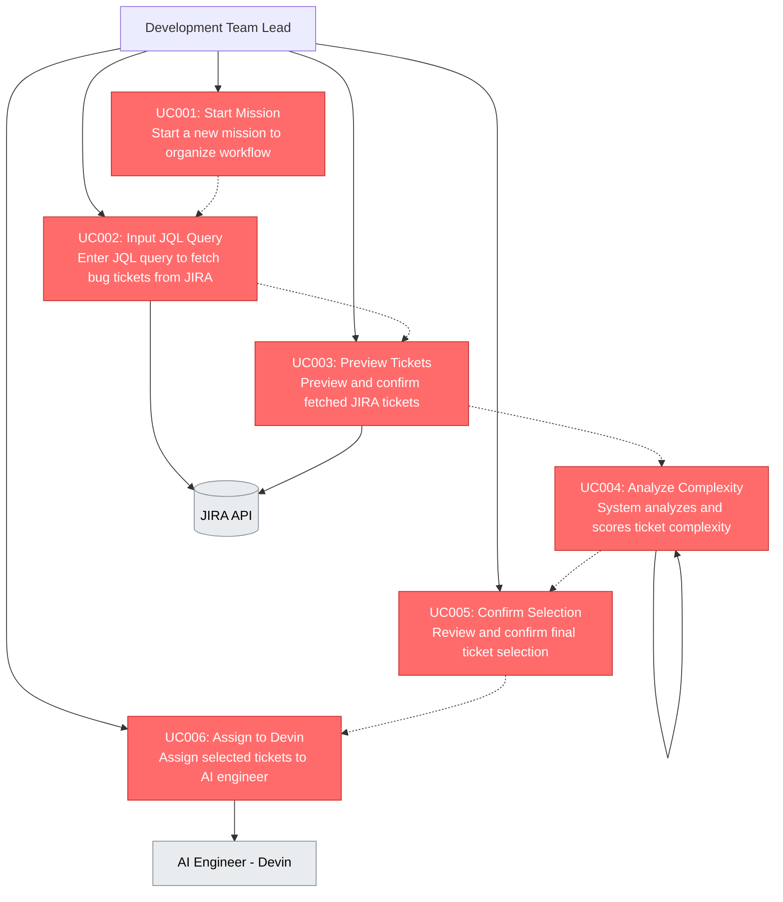

# Use Cases - Devinator MVP

## Use Case Diagram

## Use Case Descriptions

### Core MVP Use Cases (Happy Flow)

**UC001: Start Mission**
- Actor: Development Team Lead
- Description: Start a new mission to organize ticket analysis workflow
- Priority: High

**UC002: Input JQL Query**
- Actor: Development Team Lead
- Description: Enter JQL query to fetch specific bug tickets from JIRA
- Priority: High

**UC003: Preview Tickets**
- Actor: Development Team Lead
- Description: Preview and confirm fetched JIRA tickets with details
- Priority: High

**UC004: Analyze Complexity**
- Actor: System
- Description: Automatically analyze and score ticket complexity using heuristics
- Priority: High

**UC005: Confirm Selection**
- Actor: Development Team Lead
- Description: Review and confirm final ticket selection for assignment
- Priority: High

**UC006: Assign to Devin**
- Actor: Development Team Lead
- Description: Assign selected tickets to Devin (AI engineer) for resolution
- Priority: High

## MVP Happy Flow Sequence

The complete MVP workflow follows this linear sequence:

1. **UC001** (Start Mission) →
2. **UC002** (Input JQL Query) →
3. **UC003** (Preview Tickets) →
4. **UC004** (Analyze Complexity) →
5. **UC005** (Confirm Selection) →
6. **UC006** (Assign to Devin)

This represents the essential end-to-end workflow with no optional features or alternative paths.