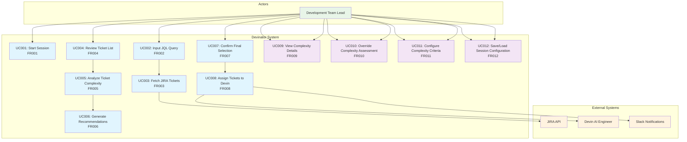

# Use Case Diagram

This diagram illustrates the key use cases for the Devinator system, mapped to the functional requirements.

## Use Case Descriptions

### Primary Workflow Use Cases

**UC001: Start Session (FR001)**
- **Actor**: Development Team Lead
- **Description**: User initiates a new analysis session to begin the ticket evaluation process
- **Preconditions**: User has access to the system
- **Postconditions**: New session is created and ready for JQL input

**UC002: Input JQL Query (FR002)**
- **Actor**: Development Team Lead
- **Description**: User enters a JQL query to define which tickets to fetch from JIRA
- **Preconditions**: Session is active
- **Postconditions**: JQL query is validated and ready for execution

**UC003: Fetch JIRA Tickets (FR003)**
- **Actor**: System
- **Description**: System executes JQL query against JIRA API and retrieves matching tickets
- **Preconditions**: Valid JQL query is provided, JIRA connection is available
- **Postconditions**: Tickets are fetched and displayed to user

**UC004: Review Ticket List (FR004)**
- **Actor**: Development Team Lead
- **Description**: User reviews the fetched tickets and confirms the list for analysis
- **Preconditions**: Tickets have been fetched from JIRA
- **Postconditions**: Ticket list is confirmed for complexity analysis

**UC005: Analyze Ticket Complexity (FR005)**
- **Actor**: System
- **Description**: System automatically analyzes each ticket using complexity heuristics
- **Preconditions**: Ticket list is confirmed
- **Postconditions**: Each ticket has a complexity score

**UC006: Generate Recommendations (FR006)**
- **Actor**: System
- **Description**: System generates recommendations for which tickets are suitable for Devin
- **Preconditions**: Tickets have complexity scores
- **Postconditions**: Recommendations are generated and displayed

**UC007: Confirm Final Selection (FR007)**
- **Actor**: Development Team Lead
- **Description**: User reviews recommendations and confirms final ticket selection
- **Preconditions**: Recommendations are available
- **Postconditions**: Final ticket selection is confirmed

**UC008: Assign Tickets to Devin (FR008)**
- **Actor**: System
- **Description**: System assigns selected tickets to Devin and logs the assignment
- **Preconditions**: Final selection is confirmed
- **Postconditions**: Tickets are assigned, logged, and notifications sent

### Supporting Use Cases

**UC009: View Complexity Details (FR009)**
- **Actor**: Development Team Lead
- **Description**: User views detailed complexity scoring information for tickets
- **Preconditions**: Complexity analysis has been performed
- **Postconditions**: Complexity details are displayed

**UC010: Override Complexity Assessment (FR010)**
- **Actor**: Development Team Lead
- **Description**: User manually overrides system complexity assessment for specific tickets
- **Preconditions**: Complexity analysis exists
- **Postconditions**: Manual override is applied and recorded

**UC011: Configure Complexity Criteria (FR011)**
- **Actor**: Development Team Lead
- **Description**: User configures the heuristics and criteria used for complexity assessment
- **Preconditions**: User has administrative privileges
- **Postconditions**: Complexity criteria are updated

**UC012: Save/Load Session Configuration (FR012)**
- **Actor**: Development Team Lead
- **Description**: User saves current session configuration or loads a previously saved configuration
- **Preconditions**: Session is active
- **Postconditions**: Configuration is saved/loaded successfully